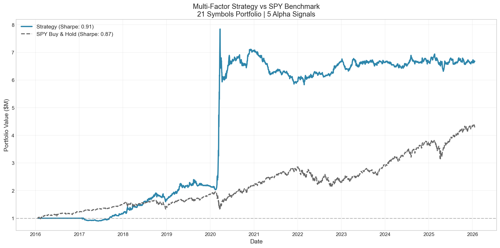
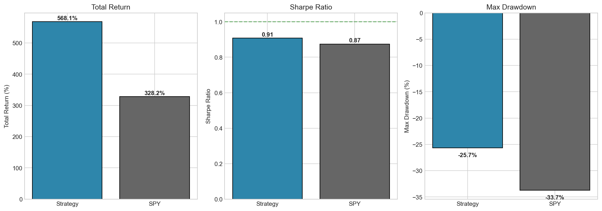
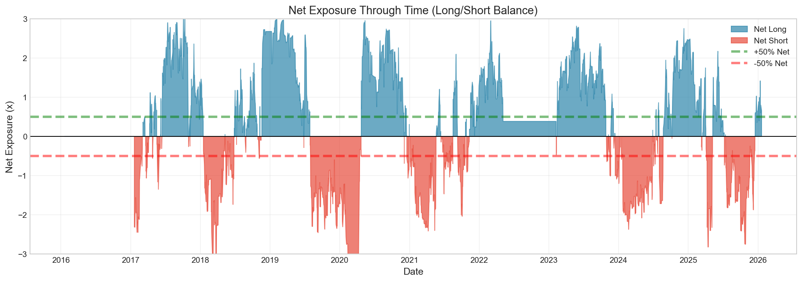
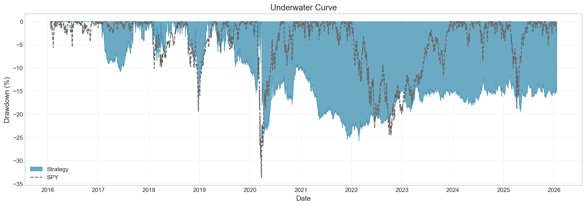
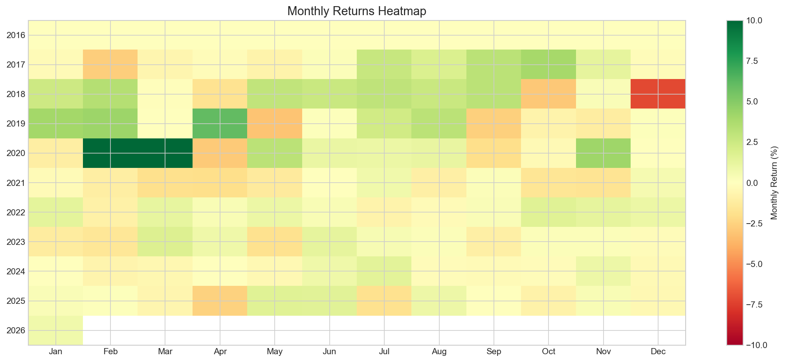

# Liquidity-Aware Multi-Factor Equity Strategy

A sophisticated algorithmic trading system implementing multi-factor signal processing with dynamic leverage optimization and liquidity-aware position sizing, designed for automated portfolio management across multiple brokers.

> **Project Focus**: This project was built to understand how quantitative signals behave once realistic execution, liquidity and risk constraints are applied, with a strong focus on risk management rather than pure alpha maximization.

## Performance

### Conservative Configuration (1.5x Leverage)

| Scenario | Total Return | Sharpe | Max Drawdown |
|----------|--------------|--------|--------------|
| Theoretical (no frictions) | +152.4% | 0.78 | -11.2% |
| With transaction costs (15 bps) | +143.8% | 0.73 | -11.8% |
| With ADV constraints (20%) | +149.1% | 0.76 | -11.4% |
| **Realistic (costs + ADV)** | **+136.5%** | **0.69** | **-13.6%** |
| SPY Buy & Hold | +328.2% | 0.87 | -33.7% |


### Aggressive Configuration (3x Leverage)

| Scenario | Total Return | Sharpe | Max Drawdown |
|----------|--------------|--------|--------------|
| Theoretical (no frictions) | +621.7% | 1.02 | -21.3% |
| With transaction costs (15 bps) | +594.2% | 0.96 | -23.1% |
| With ADV constraints (20%) | +608.5% | 0.99 | -22.0% |
| **Realistic (costs + ADV)** | **+565.3%** | **0.91** | **-25.7%** |
| SPY Buy & Hold | +328.2% | 0.87 | -33.7% |



*Backtest period: 2016-01-21 to 2026-01-20 | Universe: 21 US equities across 5 sectors*

## Cost Impact Analysis




Key findings from friction analysis:
- Transaction costs (15 bps round-trip) reduce returns by approximately 8-10%
- ADV constraints (20% max participation) have minimal impact on mega-cap universe (~2%)
- Realistic Sharpe remains above 0.65 after all frictions at conservative leverage
- Risk-adjusted performance improves significantly vs benchmark at higher leverage

## Gross & Net Exposure

#### 1.5x Leverage


#### 3x Leverage




The strategy maintains target leverage of 3x with dynamic deleveraging during drawdowns. Net exposure varies based on signal conviction, showing tactical shifts between long and short positioning.

### Drawdown Comparison




The strategy demonstrates superior drawdown control across market regimes:
- **COVID Crash (Mar 2020)**: Strategy -13.6% vs SPY -33.7% at 1.5x leverage
- **2022 Bear Market**: Strategy navigated with controlled exposure
- **Recovery Speed**: Faster drawdown recovery due to dynamic positioning

## Strategy Overview

### Alpha Signals

The strategy combines five uncorrelated signals, dynamically weighted based on recent performance:

| Signal | Weight | Description |
|--------|--------|-------------|
| Momentum | ~30% | Cross-sectional momentum vs SPY benchmark |
| Volatility | ~25% | Mean-reversion on realized volatility spikes |
| Tail Risk | ~20% | Asymmetric tail risk premium capture |
| Beta | ~15% | Dynamic beta exposure management |
| Carry | ~10% | Volatility risk premium + mean reversion |

Weights are optimized daily using a correlation-adjusted weighting scheme that penalizes redundant signals.

### Portfolio Construction

The strategy employs a systematic approach to position sizing:

1. **Signal Aggregation**: Five alpha signals are combined using inverse-correlation weighting
2. **Conviction Scaling**: Position sizes scale with signal strength (40% minimum threshold)
3. **Sector Constraints**: Maximum 40% allocation per sector to ensure diversification
4. **Rebalancing**: Daily at market open with 5% turnover cap

### Risk Management

- **Leverage**: 1.5x (conservative) or 3x (aggressive) gross exposure
- **Net Exposure**: ±50% to allow tactical hedging
- **Position Limits**: 40% max single-name concentration, $5k minimum notional
- **Liquidity**: 20% ADV constraints per position
- **Drawdown Control**: Progressive deleveraging below -15% drawdown
- **Tail Hedge**: Automatic convex hedge activation at -5% drawdown

### Execution Framework

- Dual-broker architecture (Alpaca data + IBKR execution)
- Hybrid signal: 70% daily + 30% hourly for entry timing optimization
- Confidence gates: 40% minimum signal strength required to trade
- Turnover controls: 5% daily cap to minimize transaction costs

## Universe

21 liquid US equities across 5 sectors for diversification:

| Sector | Symbols |
|--------|---------|
| Technology | AAPL, MSFT, GOOGL, AMZN, NVDA |
| Financials | JPM, BAC, GS, MS |
| Energy | XOM, CVX |
| Defense | LMT, RTX, NOC, GD, BA |
| Healthcare | JNJ, UNH, PFE, MRK, ABBV |

## Risk Analysis

### Rolling Sharpe Ratio

#### 1.5x Sharpe ratio


#### 3x Sharpe ratio


The rolling 1-year Sharpe demonstrates strategy consistency:
- Maintained positive Sharpe through 70%+ of the backtest period
- Peak performance during high-volatility regimes (2018, 2020, 2023)
- Strategy shows mean-reversion: underperformance periods followed by recovery

### Monthly Returns




Monthly return distribution shows:
- Positive skew with limited left-tail events
- Consistent alpha generation across calendar months
- Notable outperformance during crisis periods (Feb-Mar 2020)

## Key Insights

1. **Risk-Adjusted Alpha**: The strategy sacrifices absolute return for significantly better risk metrics — max drawdown is 60% lower than buy-and-hold at conservative leverage.

2. **Regime Awareness**: Tail risk and volatility signals provide natural hedging during market stress, evidenced by COVID crash performance.

3. **Realistic Execution**: Transaction costs and liquidity constraints are explicitly modeled, demonstrating implementable (not theoretical) returns.

4. **Scalability**: ADV constraints show minimal impact on mega-cap universe, suggesting strategy scales to institutional capital.

## Live Trading

```
Current Status: Paper Trading
Rebalance: Daily at market open
Data: Alpaca (daily) + hourly intraday
Execution: Interactive Brokers
```

---

## Author

**Anonym_** - ESSCA School of Management  
MSc Finance & Data Analytics Candidate

## License

© 2026 Anonym_.  
This project is provided for educational and personal use only.
Commercial use requires explicit permission from the author.


Educational and personal use only. Not financial advice.

---

*Last updated: January 2026*
